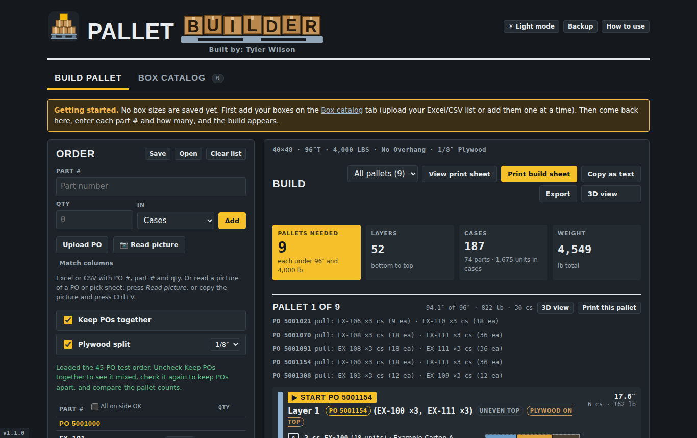
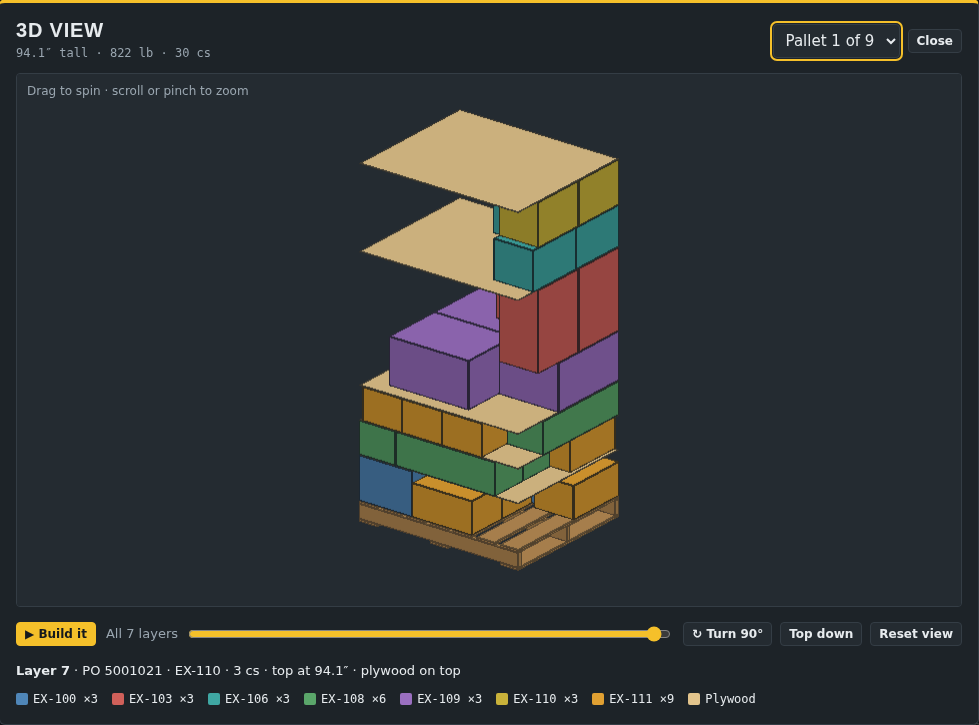
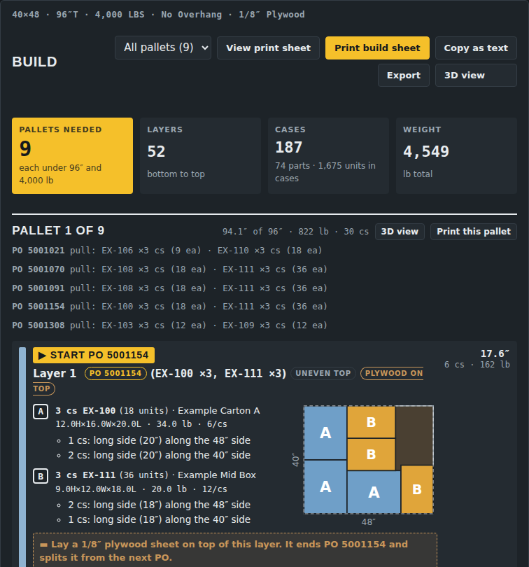

# Pallet Builder – free pallet building program

**Pallet Builder** is a free pallet planning program for warehouses, shipping and receiving. Enter a pick sheet, pick list or purchase order (PO), and it tells you **how many pallets you need** and **how to stack each pallet layer by layer**: which boxes go on each layer, which way each case faces, and where to put plywood between POs. It works as a pallet calculator, pallet stacking planner and pallet build sheet maker in one.

It runs in Edge or Chrome, works **offline**, and installs on Windows **without admin rights**.

**Website and download:** https://andthisiswat.github.io/pallet-builder/

Built by: Tyler Wilson.

## What it does

- **Pallets needed:** counts how many pallets an order takes, keeping each under your max height and max weight.
- **Layer by layer build plan:** shows every layer with the part #, case count, and which way each box faces (long side along the 40″ or 48″ side), with a top-down drawing of each layer.
- **Keep POs together:** builds each PO on its own section of the pallet, with an optional **plywood split** (1/8″ and other thicknesses) between POs.
- **3D view:** spin, zoom and watch the pallet build itself one layer at a time.
- **Upload a PO or pick list:** Excel or CSV with PO #, part # and qty. **Match columns** lets it read files from other systems.
- **Read a picture:** take a photo of a pick sheet or box label and it reads the part numbers and quantities.
- **Box catalog:** save your case sizes (H × W × L), weight per case and units per case. You can upload them from Excel or add them one at a time, and organize them in tabs.
- **Pallet & rules:** set pallet size (40×48 or anything else), max height, deck height, max weight and overhang.
- **Print build sheets** for the floor, **copy as text**, or **export** a pallet manifest and summary to CSV or Excel with pallet IDs.
- **Save and open builds** in folders by PO or order #, and back everything up to one file.
- Cases or units: quantities in units are rounded up to full cases.

## Install (Windows)

1. Download **[Pallet-Builder-Clean-Installer.zip](https://github.com/andTHISiswat/pallet-builder/raw/main/Pallet-Builder-Clean-Installer.zip)**.
2. Unzip it and run the installer. No admin rights needed.
3. Open Pallet Builder from the shortcut. Press **How to use** for a 4-minute demo video, or **Try the 45-PO test** to see an example order.

Installed copies check online for new versions and **update themselves**, keeping your saved builds, parts, PO #s, folders and tabs.

## Files

- `Pallet-Builder.html` – the program (opens in Edge or Chrome, works offline)
- `version.json` – the current version; installed copies check this and update themselves
- `Pallet-Builder-Clean-Installer.zip` – Windows installer (no admin rights needed)
- `index.html` – the project website

## Who it's for

Warehouse workers, pickers, shipping clerks, loaders and leads who build mixed pallets from pick sheets and POs, and want a quick answer to "how many pallets is this order, and how do I stack it?"
